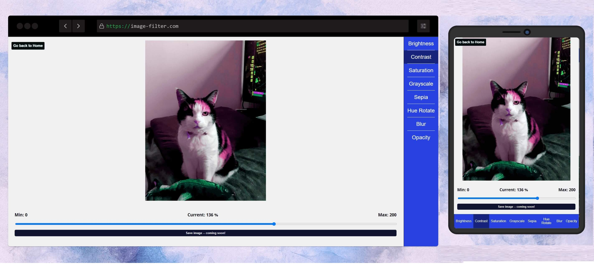

# Image Filter
Using React to apply CSS-filters to an image.

Supports:
  - Opacity
  - Contrast
  - Brightness
  - Grayscale
  - Sepia
  - Hue Rotation
  - Blur

---
Running:

---

# https://romanj55.github.io/imagefilter/
